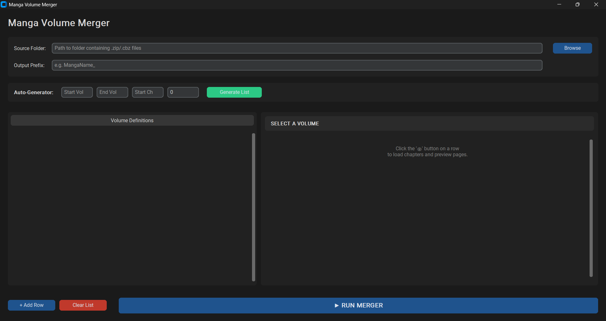

# Tankobon Binder 📚

**Tankobon Binder** is a modern, sleek Python utility designed for manga collectors and archivists. It automatically merges loose manga chapters (`.zip` / `.cbz`) into organized Volume files (`.cbz`), making them perfect for e-readers and media servers like Komga or Kavita.



## ✨ Features

* **Modern UI:** Built with `CustomTkinter` for a clean, dark-mode interface.
* **Smart Auto-Generator:** automatically calculates volume ranges (e.g., Vol 1 = Ch 1-4, Vol 2 = Ch 5-8) to save you hours of manual entry.
* **Visual Preview:** Click the **👁** button to inspect the contents of any volume before merging.
* **Inline Image Viewer:** Preview actual pages directly inside the app to verify quality or chapter breaks.
* **Smart Merging:** Automatically handles sorting and renaming (e.g., `v01_c001.0_page.jpg`) to ensure pages stay in order.
* **Threaded Processing:** Keeps the UI responsive while processing large libraries.

## 🛠️ Installation

### 1. Prerequisites
You need Python installed on your system.

### 2. Install Dependencies
This project relies on `CustomTkinter` for the UI and `Pillow` for image handling.

```bash
pip install customtkinter Pillow
```
### 3. Run the Source
```bash
python main.py
```
### 🚀 Usage
Source Folder: Select the folder containing your loose chapter files (.zip or .cbz).

Prefix: Enter the prefix you want for your output files (e.g., OnePiece_).

Define Volumes:

Auto: Use the generator toolbar to create rows for Volumes 1-100 instantly.

Manual: Click "+ Add Row" to define specific volume ranges manually.

Preview: Click the 👁 Eye Icon on any row to scan your folder and see exactly which chapters will be included. Click individual pages to preview the image.

Run: Click ▶ RUN MERGER. The app will create new .cbz files in your source folder.

### 📦 Building (Create .exe)
To build a standalone executable for Windows:

```bash
pip install pyinstaller
pyinstaller --noconsole --onefile --collect-all customtkinter main.py
```
Your .exe file will appear in the dist/ folder.

🤝 Contributing
Contributions are welcome! Please feel free to submit a Pull Request.

Fork the Project

Create your Feature Branch (git checkout -b feature/AmazingFeature)

Commit your Changes (git commit -m 'Add some AmazingFeature')

Push to the Branch (git push origin feature/AmazingFeature)

Open a Pull Request

### 📝 License
Distributed under the MIT License. See LICENSE for more information.